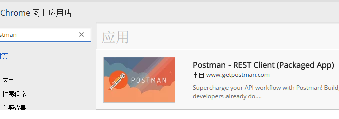

记录前端工程化的一些知识片段

[工程化利器：yeoman](https://github.com/shirlyLoveU/gitCommandCollection)

[phantomjs](./phantom.md)

[前端框架优劣分析](./mvvm.md)

[browserify](./browserify.md)

[http缓存机制](./httpCache.md)

[js知识点](./jsknowledge.md)

[svg学习笔记](./svg.md)

[模板引擎](./template.md)

[session cookie](./cookie.md)

[javascript event](./event.md)

[css knowledge](./css.md)

[mongodb note](./mongodb.md)

[mysql document](./mysql.md)

[css预处理器](./preProcessCss.md)

[服务端包含文件SSI](./SSI(server_side_include).md)

[nginx understanding](./nginx.md)

### 工具
[roots：a fast, simple, and customizable static site compiler.](http://roots.cx/articles/getting-started)

[postman-rest client](https://chrome.google.com/webstore/search/postman?hl=zh-CN)

