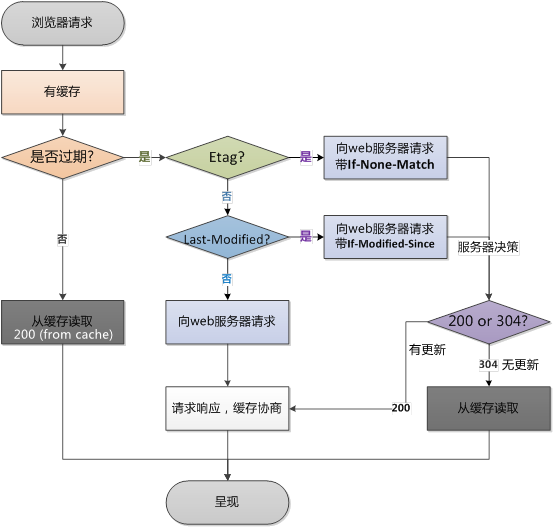

## 缓存分类

缓存分为服务端侧（server side，比如 Nginx、Apache）和客户端侧（client side，比如 web browser）。

服务端缓存又分为 代理服务器缓存 和 反向代理服务器缓存（也叫网关缓存，比如 Nginx反向代理、Squid等），其实广泛使用的 CDN 也是一种服务端缓存，目的都是让用户的请求走”捷径“，并且都是缓存图片、文件等静态资源。

客户端侧缓存一般指的是浏览器缓存，目的就是加速各种静态资源的访问，想想现在的大型网站，随便一个页面都是一两百个请求，每天 pv 都是亿级别，如果没有缓存，用户体验会急剧下降、同时服务器压力和网络带宽都面临严重的考验。

### Browser Caches
If you examine the preferences dialog of any modern Web browser (like Internet Explorer, Safari or Mozilla), you’ll probably notice a “cache” setting. This lets you set aside a section of your computer’s hard disk to store representations that you’ve seen, just for you. The browser cache works according to fairly simple rules. It will check to make sure that the representations are fresh, usually once a session (that is, the once in the current invocation of the browser).

This cache is especially useful when users hit the “back” button or click a link to see a page they’ve just looked at. Also, if you use the same navigation images throughout your site, they’ll be served from browsers’ caches almost instantaneously.

### Proxy Caches
Web proxy caches work on the same principle, but a much larger scale. Proxies serve hundreds or thousands of users in the same way; large corporations and ISPs often set them up on their firewalls, or as standalone devices (also known as intermediaries).

Because proxy caches aren’t part of the client or the origin server, but instead are out on the network, requests have to be routed to them somehow. One way to do this is to use your browser’s proxy setting to manually tell it what proxy to use; another is using interception. Interception proxies have Web requests redirected to them by the underlying network itself, so that clients don’t need to be configured for them, or even know about them.

Proxy caches are a type of shared cache; rather than just having one person using them, they usually have a large number of users, and because of this they are very good at reducing latency and network traffic. That’s because popular representations are reused a number of times.

### Gateway Caches
Also known as “reverse proxy caches” or “surrogate caches,” gateway caches are also intermediaries, but instead of being deployed by network administrators to save bandwidth, they’re typically deployed by Webmasters themselves, to make their sites more scalable, reliable and better performing.

Requests can be routed to gateway caches by a number of methods, but typically some form of load balancer is used to make one or more of them look like the origin server to clients.

Content delivery networks (CDNs) distribute gateway caches throughout the Internet (or a part of it) and sell caching to interested Web sites. Speedera and Akamai are examples of CDNs.


## 浏览器缓存机制详解

浏览器缓存控制机制有两种：HTML Meta标签 vs. HTTP头信息

### HTML Meta标签控制缓存

浏览器缓存机制，其实主要就是HTTP协议定义的缓存机制（如： Expires； Cache-control等）。但是也有非HTTP协议定义的缓存机制，如使用HTML Meta 标签，Web开发者可以在HTML页面的<head>节点中加入<meta>标签，代码如下：

```html
<META HTTP-EQUIV="Pragma" CONTENT="no-cache">
```

上述代码的作用是告诉浏览器当前页面不被缓存，每次访问都需要去服务器拉取。使用上很简单，但只有部分浏览器可以支持，而且所有缓存代理服务器都不支持，因为代理不解析HTML内容本身。而广泛应用的还是 HTTP头信息.

Many people believe that assigning a Pragma: no-cache HTTP header to a representation will make it uncacheable. This is not necessarily true; the HTTP specification does not set any guidelines for Pragma response headers; instead, Pragma request headers (the headers that a browser sends to a server) are discussed. Although a few caches may honor this header, the majority won’t, and it won’t have any effect. Use the headers below instead.

### http头信息控制缓存

浏览器有一套自己的缓存机制，而在这个机制的基础上缓存规则的制定则主要依靠后端来实现。

#### 什么是缓存

> A web cache is a mechanism for the temporary storage (caching) of web documents, such as HTML pages and images, to reduce bandwidth usage, server load, and perceived lag.

意思是： 

> WEB缓存就是临时存储WEB文档，例如HTML页面、图片等降低带宽使用、服务器负载、提升响应速度的一种机制。

#### How Web Caches Work

All caches have a set of rules that they use to determine when to serve a representation from the cache, if it’s available. Some of these rules are set in the protocols (HTTP 1.0 and 1.1), and some are set by the administrator of the cache (either the user of the browser cache, or the proxy administrator).

Generally speaking, these are the most common rules that are followed

1. If the response’s headers tell the cache not to keep it, it won’t.
2. If the request is authenticated or secure (i.e., HTTPS), it won’t be cached.
3. A cached representation is considered fresh (that is, able to be sent to a client without checking with the origin server) if:
    * It has an expiry time or other age-controlling header set, and is still within the fresh period, or
    * If the cache has seen the representation recently, and it was modified relatively long ago.
    Fresh representations are served directly from the cache, without checking with the origin server.
4. If a representation is stale, the origin server will be asked to validate it, or tell the cache whether the copy that it has is still good.
5. Under certain circumstances — for example, when it’s disconnected from a network — a cache can serve stale responses without checking with the origin server.

If no validator (an ETag or Last-Modified header) is present on a response, and it doesn't have any explicit freshness information, it will usually — but not always — be considered uncacheable.

Together, freshness and validation are the most important ways that a cache works with content. A fresh representation will be available instantly from the cache, while a validated representation will avoid sending the entire representation over again if it hasn’t changed.

we said that validation is used by servers and caches to communicate when a representation has changed. By using it, caches avoid having to download the entire representation when they already have a copy locally, but they’re not sure if it’s still fresh.

Validators are very important; if one isn’t present, and there isn’t any freshness information (Expires or Cache-Control) available, caches will not store a representation at all.

The most common validator is the time that the document last changed, as communicated in Last-Modified header. When a cache has a representation stored that includes a Last-Modified header, it can use it to ask the server if the representation has changed since the last time it was seen, with an If-Modified-Since request.

HTTP 1.1 introduced a new kind of validator called the ETag. ETags are unique identifiers that are generated by the server and changed every time the representation does. Because the server controls how the ETag is generated, caches can be sure that if the ETag matches when they make a If-None-Match request, the representation really is the same.

Almost all caches use Last-Modified times as validators; ETag validation is also becoming prevalent.

Most modern Web servers will generate both ETag and Last-Modified headers to use as validators for static content (i.e., files) automatically; you won’t have to do anything. However, they don’t know enough about dynamic content (like CGI, ASP or database sites) to generate them;


HTTP headers give you a lot of control over how both browser caches and proxies handle your representations.They can’t be seen in the HTML, and are usually automatically generated by the Web server. However, you can control them to some degree, depending on the server you use. In the following sections, you’ll see what HTTP headers are interesting, and how to apply them to your site.

HTTP headers are sent by the server before the HTML, and only seen by the browser and any intermediate caches. Typical HTTP 1.1 response headers might look like this:

```
    HTTP/1.1 200 OK
    Date: Fri, 30 Oct 1998 13:19:41 GMT
    Server: Apache/1.3.3 (Unix)
    Cache-Control: max-age=3600, must-revalidate
    Expires: Fri, 30 Oct 1998 14:19:41 GMT
    Last-Modified: Mon, 29 Jun 1998 02:28:12 GMT
    ETag: "3e86-410-3596fbbc"
    Content-Length: 1040
    Content-Type: text/html
```

HTTP 1.1 introduced a new class of headers, Cache-Control response headers, to give Web publishers more control over their content, and to address the limitations of Expires.

Useful Cache-Control response headers include:

* max-age=[seconds] — specifies the maximum amount of time that a representation will be considered fresh. Similar to Expires, this directive is relative to the time of the request, rather than absolute. [seconds] is the number of seconds from the time of the request you wish the representation to be fresh for.
* s-maxage=[seconds] — similar to max-age, except that it only applies to shared (e.g., proxy) caches.
* public — marks authenticated responses as cacheable; normally, if HTTP authentication is required, responses are automatically private.
* private — allows caches that are specific to one user (e.g., in a browser) to store the response; shared caches (e.g., in a proxy) may not.
* no-cache — forces caches to submit the request to the origin server for validation before releasing a cached copy, every time. This is useful to assure that authentication is respected (in combination with public), or to maintain rigid freshness, without sacrificing all of the benefits of caching.
* no-store — instructs caches not to keep a copy of the representation under any conditions.
* must-revalidate — tells caches that they must obey any freshness information you give them about a representation. HTTP allows caches to serve stale representations under special conditions; by specifying this header, you’re telling the cache that you want it to strictly follow your rules.
* proxy-revalidate — similar to must-revalidate, except that it only applies to proxy caches.

For example:
```
Cache-Control: max-age=3600, must-revalidate
```
**When both Cache-Control and Expires are present, Cache-Control takes precedence.**

浏览器第一次请求流程图：


浏览器再次请求流程:



## 用户行为与缓存