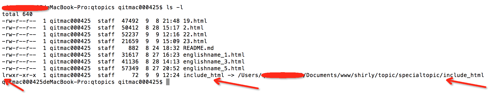

# mac tool install and use note

## 命令行rar、unrar压缩、解压文件

* [rar官网](http://www.rarlab.com/download.htm)下载mac下rar的tar包
* 下载解压后进到**rar**文件所在的目录执行以下两个命令，分别安装 rar 和 unrar：
```php
~$: sudo install -c -o $Username rar /bin
~$: sudo install -c -o $Username unrar /bin

//注意： 把 Username 替换成你自己的用户名

//解压命令
~$: unrar x compressed_file_name.rar
```

### tar压缩与解压命令详解

```
tar [-cxtzjvfpPN] 文件与目录
```

参数说明：
* -c：建立一个压缩文件（--create）
* -x从文档展开文件（--extract,--get）
* -t：列出存档中的文件和目录(--list)
* -z：用gzip对存档压缩或解压（--gzip,--ungzip）
* -j：是bzip2对存档压缩或解压
* -v：详细显示处理的文件（--verbose）
* -f：指定存档或设备（--file）
* -p：展开所有保护信息（--same-permissions,--preserve-permissions）
* -P：不要从文件名中去除‘/’（--absolute-paths）
* -N：仅存储时间较新的文件（--after-date DATE,--newer DATE）

用法说明：
```php
// 将整个/etc 目录下的文件全部打包成为 /tmp/etc.tar

tar -cvf /tmp/etc.tar /etc   // 仅打包，不压缩
tar -zcvf /tmp/etc.tar.gz /etc  // 打包后用gzip压缩

// 查看上面打包的文件/tmp/etc.tar.gz有哪些文件,注意加上z，因为我们用了gzip压缩
tar -ztvf /tmp/etc.tar.gz

// 将/tmp/etc.tar.gz文件解压在 /usr/local/src文件夹下
cd /usr/local/src
tar -zxvf /tmp/etc.tar.gz
```

## 软链和硬链

语法：

>：ln [参数] [源文件或目录] [链接名]

功 能：

用来链接文件或目录。硬链接相当于创建副本；软链接只是单纯的链接

参数解释：

* -b     	删除，覆盖以前建立的链接
* -d     	允许超级用户制作目录的硬链接
* -f     	强制执行
* -i     	交互模式，文件存在则提示用户是否覆盖
* -n     	把符号链接视为一般目录
* -s     	软链接(符号链接)
* -v     	显示详细的处理过程
* -S     	“-S<字尾备份字符串> ”或 “--suffix=<字尾备份字符串>”
* -V     	“-V<备份方式>”或“--version-control=<备份方式>”
* --help    显示帮助信息
* --version 显示版本信息


### 什么时候使用软链接

硬链接的局限:
1. 硬链接是底层文件系统的直接引用，所以不能跨文件系统建立硬链接。
2. 不能用硬链接来链接到一个目录
3. 当想要创建一个快捷方式，尤其是快捷方式的目标以后可能会改变的情况下，选用软链接会比较合适

硬链的优势：
1. 性能：由于硬链接是一个磁盘位置的引用而不是一个指向另一个文件的文件（指向你所需要的真实磁盘位置），硬链接所涉及到的磁盘寻道动作要少一次。
2. 存储空间：硬链接不占用额外的空间，因为它只是一个简单的指向已有磁盘空间的引用。而创建软链接是创建一个新文件，会消耗掉你文件系统上的少量空间（通常是4KB）

总结：
1. 目录只能创建软链接
2. 目录创建链接必须用绝对路径，相对路径创建会不成功
3. 在链接目标目录中修改文件都会在源文件目录中同步变化

举例：
将我specialtopic目录下的include_html目录 软链到html工程的include_html(此include_html本身不存在)

```
	ln -s /Users/lili.tian/Documents/www/shirly/topic/specialtopic/include_html /Users/lili.tian/Documents/www/shirly/topic/html/include_html
```
这样做了之后cd 到 html/include_html 就跟进入 specialtopic/include_html 一样

在html目录下看 **ls -l** 可以看到软链的标识



## rm-safe 保护文件不被删除

linux系统中可以使用safe-rm保护一些重要的文件不被删除，可以apt-get install safe-rm自行安装

当设置了保护文件后通过rm -rf删除文件时将不能删除

```
$ rm -rf /home/lili.tian
Skipping /home/lili.tian
```

我们要做的就是在/etc/safe-rm.conf 或者 ~/.safe-rm中添加你需要保护的路径或文件


