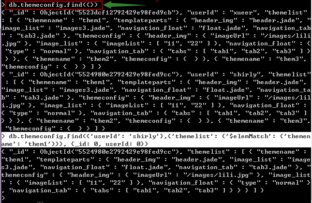
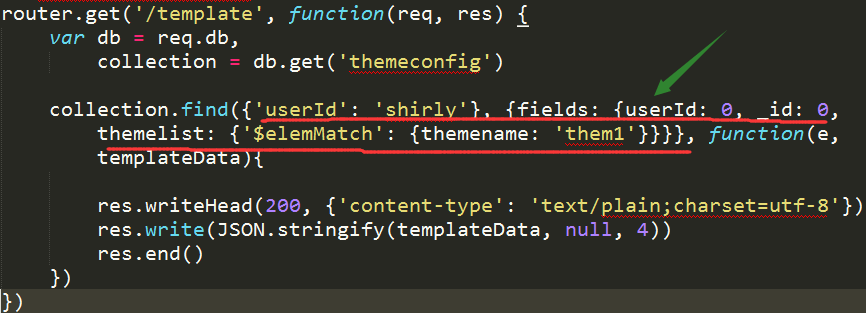

# MongoDB

### 使用monk注意点

其find(condition, query, callback)方法和mongodb console下的使用方法不太一样，比如mongo template数据的文档结构如下：
```javascript
[
    {
        "_id": "5523dcf12792429e98fed9cb",
        "userId": "xueer",
        "themelist": [
            {
                "themename": "them1",
                "templateparts": {
                    "header_img": "header.jade",
                    "image_list": "images3.jade",
                    "navigation_float": "float.jade",
                    "navigation_tab": "tab3.jade"
                },
                "themeconfig": {
                    "header_img": {
                        "imageUrl": "/images/lili.jpg"
                    },
                    "image_list": {
                        "imageList": [
                            "11",
                            "22"
                        ]
                    },
                    "navigation_float": {
                        "type": "normal"
                    },
                    "navigation_tab": {
                        "tabs": [
                            "tab1",
                            "tab2",
                            "tab3"
                        ]
                    }
                }
            },
            {
                "themename": "them2",
                "themeconfig": {}
            },
            {
                "themename": "them3",
                "themeconfig": {}
            }
        ]
    }
]
```

在mongod控制终端的要查询userId为shirly的文档数据，且只显示themelist数组元素中themename为them1的数组元素，而且不显示userId和_id，其查询语句是这样的：

```javascript
    db.themeconfig.find({'userId': 'shirly'}, {'themelist': {'$elemMatch': {'themename': 'them1'}}}, {_id: 0, userId: 0})
```

效果图如下：


monk的写法如下：




### mongodb 参考资料

[Mongodb操作之查询循序渐进对比SQL语句](http://www.cnblogs.com/lingfengblogs/p/4195984.html)

[The wise MongoDB API](https://github.com/Automattic/monk)

[MongoDB学习 (六)：查询](http://www.cnblogs.com/egger/p/3135847.html)

[MongoDB 查询上](http://www.cnblogs.com/refactor/archive/2012/07/30/2591344.html)

[MongoDB基本使用](http://www.cnblogs.com/zhwl/p/3421084.html)

[the dead-simple step-by-step guide for front-end developers to getting up and running with node.js, express, jade, and mongodb](http://cwbuecheler.com/web/tutorials/2013/node-express-mongo/)

[w3c mongo教程](http://www.w3cschool.cc/mongodb/mongodb-query.html)