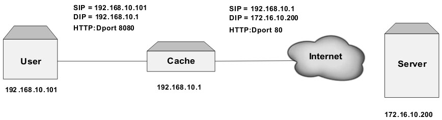
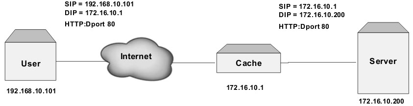
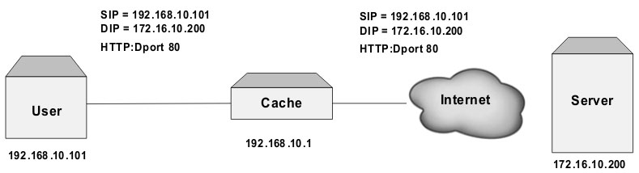
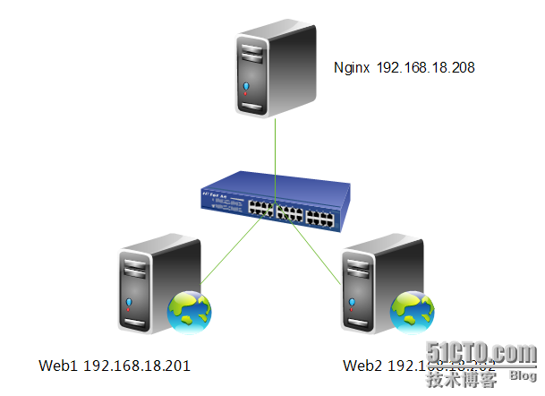

# nginx
说起Nginx，真是麻雀虽小,五脏俱全，它不单可以作为强大的web服务器，也可以作为一个反向代理服务器，而且nginx还可以按照调度规则实现动态、静态页面的分离，可以按照轮询、ip哈希、URL哈希、权重等多种方式对后端服务器做负载均衡，同时还支持后端服务器的健康检查。

## 多进程、多线程、异步模式的对比

Web服务器总的来说提供服务的方式有三种:
* 多进程方式
* 多线程的方式
* 异步方式

其中效率最高的是异步的方式，最稳定的是多进程方式，占用资源较少的是多线程的方式。

### 多进程
此种架构方式中，web服务器生成多个进程并行处理多个用户请求，进程可以按需或事先生成。有的web服务器应用程序为每个用户请求生成一个单独的进程来进行响应，不过，一旦并发请求数量达到成千上万时，多个同时运行的进程将会消耗大量的系统资源。（即每个进程只能响应一个请求或多个进程对应多个请求）
#### 优点：
* 最大的优势就在于稳定性，一个进程出错不会影响其它进程。如，服务器同时连接100个请求对应的就是100个进程，其中一个进程出错，只会杀死一个进程，还有99个进程继续响应用户请求。
* 每个进程响应一个请求

#### 缺点：
* 进程量大，进程切换次数过多，导致CPU资源使用效率低
* 每个进程的地址空间是独立的，很多空间中重复的数据，所以内存使用效率低
* 进程切换由内核完成，占用CPU资源

### 多线程
在多线程方式中，每个线程响应一个请求，由于线程之间共享进程的数据，所以线程的开销较小，性能就会提高。

#### 优点：
* 线程间共享进程数据
* 每个线程响应一个请求
* 线程切换不可避免（切换量级比较轻量）
* 同一进程的线程可以共享进程的诸多资源，比如打开的文件
* 对内存的需求较之进程有很大下降
* 读可以共享，写不可以共享

#### 缺点：
线程快速切换时会带来线程抖动
多线程会导致服务器不稳定

### 异步方式
一个进程或线程响应多个请求，不需要任何额外开销的，性能最高，占用资源最少。但也有问题一但进程或线程出错就会导致整个服务器的宕机。

## nginx工作原理
Nginx会按需同时运行多个进程：一个主进程(master)和几个工作进程(worker)，配置了缓存时还会有缓存加载器进程(cache loader)和缓存管理器进程(cache manager)等。所有进程均是仅含有一个线程，并主要通过“共享内存”的机制实现进程间通信。主进程以root用户身份运行，而worker、cache loader和cache manager均应以非特权用户身份运行。

### 主进程主要完成如下工作：
* 读取并验正配置信息；
* 创建、绑定及关闭套接字；
* 启动、终止及维护worker进程的个数；
* 无须中止服务而重新配置工作特性；
* 控制非中断式程序升级，启用新的二进制程序并在需要时回滚至老版本；
* 重新打开日志文件；
* 编译嵌入式perl脚本；

### worker进程主要完成的任务包括：
* 接收、传入并处理来自客户端的连接；
* 提供反向代理及过滤功能；
* nginx任何能完成的其它任务；

注，如果负载以CPU密集型应用为主，如SSL或压缩应用，则worker数应与CPU数相同；如果负载以IO密集型为主，如响应大量内容给客户端，则worker数应该为CPU个数的1.5或2倍。

## 认识代理
代理（Proxy），也称网络代理，是一种特殊的网络服务，允许一个网络终端（一般为客户端）通过这个服务与另一个网络终端（一般为服务器）进行非直接的连接。一些网关、路由器等网络设备具备网络代理功能。一般认为代理服务有利于保障网络终端的隐私或安全，防止攻击。

代理按照其部署的位置和工作方式，大致可以分为三类：正向代理，反向代理和透明代理。

### 正向代理
正向代理（Forward Proxy）是一个位于客户端和原始服务器(origin server)之间的服务器，为了从原始服务器取得内容，客户端向代理发送一个请求并指定目标(原始服务器)，然后代理向原始服务器转交请求并将获得的内容返回给客户端。

在正向代理的方式下，用户需要显示的配置其代理服务器。配置完成后，用户对其他网络服务的访问都先到达代理服务器，如果此时代理服务器缓存了用户想要的信息，且资源还没有失效，则代理服务器将直接把资源返回给用户，不再发请求到源服务器。如果代理服务器缓存中没有用户想要的资源，或者资源已经失效，则代理服务器将去源服务器请求，然后再将信息返回给用户，并在代理服务器中缓存。

看一个典型的公司网络使用正向代理的例子：



可见内网用户想要访问外部的网络都必须通过代理服务器完成。内网用户主机和代理服务器部署在同一个网络环境中，内网用户的IP地址为：192.168.10.101，代理服务器的IP地址为：192.168.10.1，用户想要访问的外网服务器IP地址为：172.16.10.200。通常，用户在使用代理前，需要为所使用的主机配置好代理服务器的IP地址和端口，这里是192.168.10.1和8080。

正向代理多用于中小企业网络环境，正向代理服务器作为企业的出口网关提供代理服务、内容缓存、Internet访问控制、安全认证等功能。

### nginx反向代理 
反向代理（Reverse Proxy）方式是指以代理服务器来接受internet上的连接请求，然后将请求转发给内部网络上的服务器，并将从服务器上得到的结果返回给internet上请求连接的客户端，此时代理服务器对外就表现为一个服务器。

#### nginx反向代理作用
* **保护网站安全**：任何来自Internet的请求都必须先经过代理服务器；
* **通过配置缓存功能加速Web请求**：可以缓存真实Web服务器上的某些静态资源，减轻真实Web服务器的负载压力；
* **实现负载均衡**：充当负载均衡服务器均衡地分发请求，平衡集群中各个服务器的负载压力；



上图演示了一个反向代理的应用实例。代理服务器和应用服务器部署在同一个网络环境中，用户的IP地址为192.168.10.101,应用服务器IP地址为172.16.10.200，反向代理服务器IP地址为172.16.10.1。用户直接访问反向代理服务器的IP地址请求服务，反向代理服务器接收到用户的请求后，首先查看缓存中是否有用户想要的数据，如果有，则直接返回给用户；如果没有，则反向代理服务器会将用户的请求转发给应用服务器，并将应用服务器返回的数据反馈给用户，同时将数据缓存起来。

如果反向代理服务器的缓存命中率较高，将会大大减轻应用服务器的访问压力。对于应用服务器来说，反向代理服务器还提供了安全隔离作用。

### 透明代理
透明代理（Transparent Proxy）可以看作是通过网络设备或协议实现的正向代理工作模式，因而具备很多和正向代理相同的特点，多用于企业网环境和运营商环境。

在透明代理方式下，用户不需要配置代理服务器的地址，用户也几乎感受不到代理服务器的存在。用户发送给应用服务器的请求，首先会被透明代理服务器截获，透明代理服务器中会查看是否缓存了用户的请求数据，如果有，则直接返回给用户，如果没有则会向应用服务器请求，并将数据反馈给用户，同时将数据缓存起来。

#### 实现透明代理一般有两种方案：

* 一种是通过路由器，用户的路由器需要支持WCCP（Web Cache Control Protocol）协议。路由器设置了WCCP后，会将指定的用户流量转发给透明代理服务器,由透明代理服务器提供服务；
* 另一种是通过4层交换机将用户的流量转发给透明代理服务器。



上图演示了一个透明代理的应用实例。与正向代理的部署方式相似，用户服务器和透明代理服务器部署在同一个网络环境中，用户的服务器IP地址为：192.168.10.101，透明代理服务器的IP地址为：192.168.10.1，应用服务器的服务地址为：172.16.10.200。用户发往应用服务器的请求会首先被透明代理服务器拦截，透明代理服务器查看是否缓存了用户想要的数据，如果有则直接返回给用户，如果没有，则将用户的请求转发至应用服务器，接受返回的结果，并将结果返回给用户，同时缓存在透明代理服务器中。

透明代理的工作方式和正向代理很相似，发挥的作用也非常类似。与正向代理不同的是用户在使用透明代理时，不需要配置任何代理，使得用户几乎感觉不到代理服务器的存在。

### 总结

以上三种代理方式中，由于正向代理和透明代理往往和用户部署在同一个网络环境中，物理上距离用户更近，所以一旦缓存命中，往往能给用户“更快”的网络体验；而反向代理一般和应用服务器部署在一起，往往可以大幅度减轻应用服务器的负载压力。

### 正向代理与反向代理区别
简单点说，二者都是A通过B去访问C，正向代理是A知道B的存在并且A上面可能还需要做一些特殊配置，反向代理则是A不需要做任何配置也不知道B的存在或者说A认为B就是他要访问的C。正向代理通常是因为A不能访问C，反向代理则是C为了安全、稳定等因素考虑而不让A去直接访问它。正向代理通常是在客户端做一些事情才能实现，而反向代理是在服务端做一些事情来实现的。

正向代理（Forward Proxy）通常被称为代理，是大家经常遇到的情况，比如某个国外的网站在大陆被屏蔽了，你想在国内访问的话需要挂代理，那么这个代理就是正向代理。需要你在自己机器上做一些相关操作，比如安装个代理软件什么的来实现。

反向代理（reverse proxy），通常系统管理员（System Admin）会遇到，为了隐藏服务（一般是网站）的真实地址，很多大一点的公司都会使用反向代理的。用户访问到的其实是反向代理服务器，而真正的服务器其实隐藏在了反向代理后面。

反向代理还有个用处就是分域代理，不同区域的用户访问到不同的反向代理服务器，这种情况一般是为了提高网站的访问速度。比如有个网站的真正服务器在北京，而在北京、云南或者福建的用户访问时都感觉速度非常快，这就是分域代理的功劳。网站方会在不同地区都放置反向代理服务器，用户访问到的都是离用户最近的反向代理服务器。而反向代理服务器到真正的后端服务器其实一般走的都是运营商的专线，需要网站方花钱来买的，所以速度非常快，很多大型的网站为了提高用户体验通常都会这样做的。关于网站怎样才能让用户访问到离用户最近的反向代理服务器就是 DNS 的功劳了，而这也正是我们常说的CDN部署

## nginx配置详解

```php
#定义Nginx运行的用户和用户组
user nobody;

#nginx进程数，建议设置为等于CPU总核心数。
worker_processes 8;

#全局错误日志定义类型，[ debug | info | notice | warn | error | crit ]
error_log /var/log/nginx/error.log info;

#进程文件
pid /var/run/nginx.pid;

#一个nginx进程打开的最多文件描述符数目，理论值应该是最多打开文件数（系统的值ulimit -n）与nginx进程数相除，但是nginx分配请求并不均匀，所以建议与ulimit -n的值保持一致。
worker_rlimit_nofile 65535;

#工作模式与连接数上限
events
{
    #参考事件模型，use [ kqueue | rtsig | epoll | /dev/poll | select | poll ]; epoll模型是Linux 2.6以上版本内核中的高性能网络I/O模型，如果跑在FreeBSD上面，就用kqueue模型。
    use epoll;
    #单个进程最大连接数（最大连接数=连接数*进程数）
    worker_connections 65535;
}

#设定http服务器
http 
{
    include mime.types; #文件扩展名与文件类型映射表
    default_type application/octet-stream; #默认文件类型
    #charset utf-8; #默认编码
    server_names_hash_bucket_size 128; #服务器名字的hash表大小
    client_header_buffer_size 32k; #上传文件大小限制
    large_client_header_buffers 4 64k; #设定请求缓
    client_max_body_size 8m; #设定请求缓
    sendfile on; #开启高效文件传输模式，sendfile指令指定nginx是否调用sendfile函数来输出文件，对于普通应用设为 on，如果用来进行下载等应用磁盘IO重负载应用，可设置为off，以平衡磁盘与网络I/O处理速度，降低系统的负载。注意：如果图片显示不正常把这个改成off。
    autoindex on; #开启目录列表访问，合适下载服务器，默认关闭。
    tcp_nopush on; #防止网络阻塞
    tcp_nodelay on; #防止网络阻塞
    keepalive_timeout 120; #长连接超时时间，单位是秒

    #FastCGI相关参数是为了改善网站的性能：减少资源占用，提高访问速度。下面参数看字面意思都能理解。
    fastcgi_connect_timeout 300;
    fastcgi_send_timeout 300;
    fastcgi_read_timeout 300;
    fastcgi_buffer_size 64k;
    fastcgi_buffers 4 64k;
    fastcgi_busy_buffers_size 128k;
    fastcgi_temp_file_write_size 128k;

    #gzip模块设置
    gzip on; #开启gzip压缩输出
    gzip_min_length 1k; #最小压缩文件大小
    gzip_buffers 4 16k; #压缩缓冲区
    gzip_http_version 1.0; #压缩版本（默认1.1，前端如果是squid2.5请使用1.0）
    gzip_comp_level 2; #压缩等级
    gzip_types text/plain application/x-javascript text/css application/xml;
    #压缩类型，默认就已经包含text/html，所以下面就不用再写了，写上去也不会有问题，但是会有一个warn。
    gzip_vary on;
    #limit_zone crawler $binary_remote_addr 10m; #开启限制IP连接数的时候需要使用

    upstream blog.ha97.com {
        #upstream的负载均衡，weight是权重，可以根据机器配置定义权重。weight参数表示权值，权值越高被分配到的几率越大。
        server 192.168.80.121:80 weight=3;
        server 192.168.80.122:80 weight=2;
        server 192.168.80.123:80 weight=3;
    }

    #虚拟主机的配置
    server
    {
        #监听端口
        listen 80;
        #域名可以有多个，用空格隔开（当前服务的域名）
        server_name www.ha97.com ha97.com;
        index index.html index.htm index.php;
        root /data/www/ha97;
        location ~ .*.(php|php5)?$ {
            fastcgi_pass 127.0.0.1:9000;
            fastcgi_index index.php;
            include fastcgi.conf;
        }
        #图片缓存时间设置
        location ~ .*.(gif|jpg|jpeg|png|bmp|swf)$ {
            expires 10d;
        }
        #JS和CSS缓存时间设置
        location ~ .*.(js|css)?$ {
            expires 1h;
        }
        #日志格式设定
        log_format access '$remote_addr - $remote_user [$time_local] "$request" '
        '$status $body_bytes_sent "$http_referer" '
        '"$http_user_agent" $http_x_forwarded_for';
        #定义本虚拟主机的访问日志
        access_log /var/log/nginx/ha97access.log access;

        #对 "/" 启用反向代理
        location / {
            #设置被代理服务器的地址和被映射的URI，地址可以使用主机名或IP加端口号的形式，如:proxy_pass http://localhost:8000/uri/;
            proxy_pass http://127.0.0.1:88;
            proxy_redirect off;
            #此指令允许将发送到被代理服务器的请求头重新定义或者增加一些字段，此值可以是个文本、变量或它们的组合；默认值host and connection；使用字段http，server，location
            proxy_set_header X-Real-IP $remote_addr;
            #后端的Web服务器可以通过X-Forwarded-For获取用户真实IP
            proxy_set_header X-Forwarded-For $proxy_add_x_forwarded_for;
            #以下是一些反向代理的配置，可选。
            proxy_set_header Host $host;
            client_max_body_size 10m; #允许客户端请求的最大单文件字节数
            client_body_buffer_size 128k; #缓冲区代理缓冲用户端请求的最大字节数，
            proxy_connect_timeout 90; #nginx跟后端服务器连接超时时间(代理连接超时)
            proxy_send_timeout 90; #后端服务器数据回传时间(代理发送超时)
            proxy_read_timeout 90; #连接成功后，后端服务器响应时间(代理接收超时)
            proxy_buffer_size 4k; #设置代理服务器（nginx）保存用户头信息的缓冲区大小
            proxy_buffers 4 32k; #proxy_buffers缓冲区，网页平均在32k以下的设置
            proxy_busy_buffers_size 64k; #高负荷下缓冲大小（proxy_buffers*2）
            proxy_temp_file_write_size 64k;
            #设定缓存文件夹大小，大于这个值，将从upstream服务器传
        }

        #设定查看Nginx状态的地址
        location /NginxStatus {
            stub_status on;
            access_log on;
            auth_basic "NginxStatus";
            auth_basic_user_file conf/htpasswd;
            #htpasswd文件的内容可以用apache提供的htpasswd工具来产生。
        }

        #本地动静分离反向代理配置
        #所有jsp的页面均交由tomcat或resin处理
        location ~ .(jsp|jspx|do)?$ {
            proxy_set_header Host $host;
            proxy_set_header X-Real-IP $remote_addr;
            proxy_set_header X-Forwarded-For $proxy_add_x_forwarded_for;
            proxy_pass http://127.0.0.1:8080;
        }
        #所有静态文件由nginx直接读取不经过tomcat或resin
        location ~ .*.(htm|html|gif|jpg|jpeg|png|bmp|swf|ioc|rar|zip|txt|flv|mid|doc|ppt|pdf|xls|mp3|wma)$ { 
            expires 15d; 
        }
        location ~ .*.(js|css)?$ { 
            expires 1h; 
        }
    }
}
```

### nginx配置的补充说明
#### nginx 事件模型events
与apache相类，nginx针对不同的操作系统，有不同的事件模型

* **标准事件模型**：
Select、poll属于标准事件模型，如果当前系统不存在更有效的方法，nginx会选择select或poll
* **高效事件模型**：
Kqueue：使用于FreeBSD 4.1+, OpenBSD 2.9+, NetBSD 2.0 和 MacOS X.使用双处理器的MacOS X系统使用kqueue可能会造成内核崩溃。
* **Epoll**:使用于Linux内核2.6版本及以后的系统。
* **/dev/poll**：使用于Solaris 7 11/99+, HP/UX 11.22+ (eventport), IRIX 6.5.15+ 和 Tru64 UNIX 5.1A+。
* **Eventport**：使用于Solaris 10. 为了防止出现内核崩溃的问题， 有必要安装安全补丁

#### 请求头部的缓冲区大小client_header_buffer_size
客户端请求头部的缓冲区大小，这个可以根据你的系统分页大小来设置，一般一个请求头的大小不会超过1k，不过由于一般系统分页都要大于1k，所以这里设置为分页大小。
分页大小可以用命令getconf PAGESIZE 取得。
```
[root@web001 ~]# getconf PAGESIZE
4096
```
但也有client_header_buffer_size超过4k的情况，但是client_header_buffer_size该值必须设置为“系统分页大小”的整倍数。
```php
client_header_buffer_size 4k;
```

## 负载均衡详解及其列表基本配置
当网站名气大涨访问的人越来越多一台服务器实在是顶不住，于是我们会加多台服务器，那么多台服务器又怎么配置代理呢，以下以两台服务器进行说明

### upstream 负载均衡模块说明

```php
upstream test.net {
    ip_hash;
    server www.example.com weight=4;
    server 192.168.10.14:80  down;
    server 192.168.10.15:8009  max_fails=3  fail_timeout=20s;
    server unix:/tmp/backend;
}
server {
  location / {
    proxy_pass  http://test.net;
  }
}
```
upstream是Nginx的HTTP Upstream模块，这个模块通过一个简单的调度算法来实现客户端IP到后端服务器的负载均衡。在上面的设定中，通过upstream指令指定了一个负载均衡器的名称test.net。这个名称可以任意指定，在后面需要用到的地方直接调用即可。

### upstream 支持的负载均衡算法
Nginx的负载均衡模块目前支持4种调度算法，下面进行分别介绍，其中后两项属于第三方调度算法。  

* **轮询（默认）**: 每个请求按时间顺序逐一分配到不同的后端服务器，如果后端某台服务器宕机，故障系统被自动剔除，使用户访问不受影响。Weight 指定轮询权值，Weight值越大，分配到的访问机率越高，主要用于后端每个服务器性能不均的情况下。

* **ip_hash**: 每个请求按访问IP的hash结果分配，这样来自同一个IP的访客固定访问一个后端服务器，有效解决了动态网页存在的session共享问题。

* **fair**: 这是比上面两个更加智能的负载均衡算法。此种算法可以依据页面大小和加载时间长短智能地进行负载均衡，也就是根据后端服务器的响应时间来分配请求，响应时间短的优先分配。Nginx本身是不支持fair的，如果需要使用这种调度算法，必须下载Nginx的upstream_fair模块。

* **url_hash**: 此方法按访问url的hash结果来分配请求，使每个url定向到同一个后端服务器，可以进一步提高后端缓存服务器的效率。Nginx本身是不支持url_hash的，如果需要使用这种调度算法，必须安装Nginx 的hash软件包。

### upstream 支持的状态参数
在HTTP Upstream模块中，可以通过server指令指定后端服务器的IP地址和端口，同时还可以设定每个后端服务器在负载均衡调度中的状态。常用的状态有：   

* **weight**: 转发权重
* **down**: 表示当前的server暂时不参与负载均衡。只有 **ip_hash** 配置项才有用
* **backup**: 预留的备份机器。当其他所有的非backup机器出现故障或者忙的时候，才会请求backup机器，因此这台机器的压力最轻。**ip_hash**设置时不起作用
* **max_fails**: 允许请求失败的次数，默认为1。当超过最大次数时，返回proxy_next_upstream 模块定义的错误。
* **fail_timeout**: 在经历了max_fails次失败后，暂停服务的时间。max_fails可以和fail_timeout一起使用。
注，当负载调度算法为ip_hash时，后端服务器在负载均衡调度中的状态不能是weight和backup。

### 实验拓扑


### 配置nginx负载均衡
```php
[root@nginx ~]# vim /etc/nginx/nginx.conf
upstream webservers {
  server 192.168.18.201 weight=1;
  server 192.168.18.202 weight=1;
}
server {
  listen       80;
  server_name  localhost;
  #charset koi8-r;
  #access_log  logs/host.access.log  main;
  location / {
          proxy_pass      http://webservers;
          proxy_set_header  X-Real-IP  $remote_addr;
  }
}
```

**注**: upstream是定义在server{ }之外的，不能定义在server{ }内部。定义好upstream之后，用proxy_pass引用一下即可。

### 配置nginx进行健康状态检查
max_fails可以和fail_timeout一起使用，进行健康状态检查。
```php
upstream webservers {
    server 192.168.18.201 weight=1 max_fails=2 fail_timeout=2;
    server 192.168.18.202 weight=1 max_fails=2 fail_timeout=2;
}
```

配置完后重启nginx，然后先停止Web1，进行测试。会看到，现在只能访问Web2，再重新启动Web1，再次访问一下。大家就会看到web1又可以重新访问，说明nginx的健康状态检查配置成功。但大家想一下，如果不幸的是所有服务器都不能提供服务了怎么办，用户打开页面就会出现出错页面，那么会带来用户体验的降低，所以我们能不能像配置LVS一样配置sorry_server呢，答案是可以的，但这里不是配置sorry_server而是配置backup。

### 配置backup服务器
```php
[root@nginx ~]# vim /etc/nginx/nginx.conf
server {
    listen 8080;
    server_name localhost;
    root /data/www/errorpage;
    index index.html;
}
upstream webservers {
    server 192.168.18.201 weight=1 max_fails=2 fail_timeout=2;
    server 192.168.18.202 weight=1 max_fails=2 fail_timeout=2;
    server 127.0.0.1:8080 backup;
}
[root@nginx ~]# mkdir -pv /data/www/errorpage
[root@nginx errorpage]# cat index.html
<h1>Sorry......</h1>
```
关闭Web服务器并进行测试：

```php
[root@web1 ~]# service httpd stop
停止 httpd：                                               [确定]
[root@web2 ~]# service httpd stop
停止 httpd：                                               [确定]
```

我们会发现当所有服务器都不能工作时，就会启动备份服务器。好了，backup服务器就配置到这里，下面我们来配置ip_hash负载均衡。

### 配置ip_hash负载均衡
```php
[root@nginx ~]# vim /etc/nginx/nginx.conf
upstream webservers {
    ip_hash;
    server 192.168.18.201 weight=1 max_fails=2 fail_timeout=2;
    server 192.168.18.202 weight=1 max_fails=2 fail_timeout=2;
    #server 127.0.0.1:8080 backup;
}
```

***注***: 当负载调度算法为ip_hash时，后端服务器在负载均衡调度中的状态不能有backup。（有人可能会问，为什么呢？大家想啊，如果负载均衡把你分配到backup服务器上，你能访问到页面吗？不能，所以不能配置backup服务器）

重启nginx服务，然后不断的刷新页面一直会显示Web2，说明ip_hash负载均衡配置成功。

### 统计Web2的访问连接数
```
[root@web2 ~]# netstat -an | grep :80 | wc -l
304
```
**注**: 你不断的刷新，连接数会越来越多。

## nginx正向代理配置文件
```php
server {
    resolver 8.8.8.8;
    resolver_timeout 5s;
 
    listen 0.0.0.0:8080;
 
    access_log  /home/reistlin/logs/proxy.access.log;
    error_log   /home/reistlin/logs/proxy.error.log;
 
    location / {
        proxy_pass $scheme://$host$request_uri;
        proxy_set_header Host $http_host;
 
        proxy_buffers 256 4k;
        proxy_max_temp_file_size 0;
 
        proxy_connect_timeout 30;
 
        proxy_cache_valid 200 302 10m;
        proxy_cache_valid 301 1h;
        proxy_cache_valid any 1m;
    }
}

```
以上Nginx正向代理配置说明：

* 配置 DNS 解析 IP 地址，比如 Google Public DNS，以及超时时间（5秒）。
```php
resolver 8.8.8.8;
resolver_timeout 5s;
```
* 配置正向代理参数，均是由 Nginx 变量组成。其中 proxy_set_header 部分的配置，是为了解决如果 URL 中带 "."（点）后 Nginx 503 错误。
```php
proxy_pass $scheme://$host$request_uri;
proxy_set_header Host $http_host;
```
* 配置缓存大小，关闭磁盘缓存读写减少I/O，以及代理连接超时时间。
```php
proxy_buffers 256 4k;
proxy_max_temp_file_size 0;
proxy_connect_timeout 30;
```
* 配置代理服务器 Http 状态缓存时间。
```php
proxy_cache_valid 200 302 10m;
proxy_cache_valid 301 1h;
proxy_cache_valid any 1m;
```
**注**: 不支持代理 Https 网站

因为 Nginx 不支持 CONNECT，所以无法正向代理 Https 网站（网上银行，Gmail）。
如果访问 Https 网站，比如：https://www.google.com，Nginx access.log 日志如下：
```
"CONNECT www.google.com:443 HTTP/1.1" 400
```

## nginx 正则

### 正则表达式匹配

~   区分大小写匹配

~*  不区分大小写匹配

!~  区分大小写不匹配

!~* 不区分大小写不匹配

^   以什么开头的匹配

$   以什么结尾的匹配

\   转义字符可以转. * ?等

*   代表任意字符

^~

=   精确的查找地址

@   为一个location进行命名，即自定义一个location，这个location不能被外界所访问，只能用于Nginx产生的子请求，主要为error_page和try_files。


### 文件及目录匹配

-f和!-f 用来判断是否存在文件
-d和!-d 用来判断是否存在目录
-e和!-e 用来判断是否存在文件或目录
-x和!-x 用来判断文件是否可执行

先看个demo

```php
#　只匹配 / 的查询
location = /

# 匹配任何以 / 开始的查询，但是正则表达式与一些较长的字符串将被首先匹配。
location  /

# 匹配任何以 /images/ 开始的查询并且停止搜索，不检查正则表达式。  
location ^~ /images/ 

# 匹配任何以.gif、.jpg 或 .jpeg 结尾的请求，但是所有 /images/ 目录的请求将在上面 ^~ /images/ 中处理
location ~* .(gif|jpg|jpeg)$ {
```

### 可以通过正则表达式匹配的指令
Nginx在很多模块中都有内置的变量，常用的内置变量在HTTP核心模块中，这些变量都可以使用正则表达式进行匹配。

#### location: http核心模块
**语法**：location [=|~|~*|^~|@] /uri/ { ... } 
**默认值**：no 
**使用字段**：server 

要使用正则表达式必须指定前缀: **~*、 ~ **

^~ 标记禁止在字符串匹配后检查正则表达式
=  标记可以在URI和location之间定义精确的匹配，在精确匹配完成后并不进行额外的搜索

所以^~、=、@这3个标识符后面不能跟正则表达式，虽然配置文件检查会通过，而且没有任何警告，但是他们并不会进行匹配

**location指令对于后面值的匹配顺序为**:

1. 标识符 **=** 的location会最先进行匹配，如果请求uri匹配这个location，将对请求使用这个location的配置，立即停止查询。
2. 进行字符串匹配，如果匹配到的location有^~这个标识符，匹配停止,返回这个location的配置。
3. 按照配置文件中定义的顺序进行正则表达式匹配。最早匹配的location将返回里面的配置。
4.如果正则表达式能够匹配到请求的uri，将使用这个正则对应的location，如果没有，则使用第二条匹配的结果。

##### proxy_pass说明
```php
location ^~ /outer/ {
    #case A： url最后以/结尾
    proxy_pass http://tomcat:8080/
    #case B： url最后没有/
    #proxy_pass http://tomcat:8080  
}
```
上述的转发代码关键在于最后的/，访问localhost/outer/in.html，其中case A 会转发到tomcat:8080/in.html， 而case B 会转发到 tomcat:8080/outer/in.html，所以务必注意了。

#### server_name
server_name用于配置基于域名或IP的虚拟主机，这个指令也是可以使用正则表达式的，但是注意，这个指令中的正则表达式不用带任何的标识符，但是必须以~开头：

```php
server {
  server_name   www.example.com   ~^wwwd+.example.com$;
}
```

#### fastcgi_split_path_info

这个指令按照CGI标准来设置SCRIPT_FILENAME (SCRIPT_NAME)和PATH_INFO变量，它是一个被分割成两部分（两个引用）的正则表达式。如下：
```php
location ~ ^.+.php {
  (...)
  fastcgi_split_path_info ^(.+.php)(.*)$;
  fastcgi_param SCRIPT_FILENAME /path/to/php$fastcgi_script_name;
  fastcgi_param PATH_INFO $fastcgi_path_info;
  fastcgi_param PATH_TRANSLATED $document_root$fastcgi_path_info;
  (...)
}
```

第一个引用（.+.php）加上/path/to/php将作为SCRIPT_FILENAME，第二个引用(.*)为PATH_INFO，例如请求的完整URI为show.php/article/0001，则上例中SCRIPT_FILENAME的值为/path/to/php/show.php，PATH_INFO则
为/article/0001。

#### gzip_disable
通过正则表达式来指定在哪些浏览器中禁用gzip压缩。

```php
gzip_disable     "msie6";
```

####　rewrite
Rewrite主要的功能就是实现URL的重写,Nginx的Rewrite规则采用PCRE(Perl Compatible Regular Expressions)Perl兼容正则表达式的语法进行规则匹配,如果您需要Nginx的Rewrite功能,在编译Nginx之前,须要编译安装PCRE库.通过Rewrite规则,可以实现规范的URL,根据变量来做URL转向和选择不同的配置.从一个location跳转到另一个location，不过这样的循环最多可以执行10次，超过后nginx将返回500错误。同时，重写模块包含set指令，来创建新的变量并设其值，这在有些情景下非常有用的，如记录条件标识、传递参数到其他location、记录做了什么等等。

Nginx的rewrite语法其实很简单.用到的指令无非是这几个：
* set
* if
* return
* break
* rewrite

##### set
set主要用来设置变量

##### if
if主要用来判断一些在rewrite语句中无法直接匹配的条件,比如检测文件存在与否,http header,cookie等

> 用法: if(条件) {…}

解释说明：
* if指令不支持嵌套,不支持多个条件&&和||处理.

* 当表达式只是一个变量时,如果值为空或者任何以0开头的字符串都会当作false

* 直接比较内容时,使用 = 和 !=

* 使用正则表达式匹配时,可以使用 **~、 ~*、 !~、 !~*、 -f、 !-f、 -d、 !-d、 -e、 !-e、 -x、 !-x **

* 因为nginx使用花括号{}判断区块,所以当正则中包含花括号时,则必须用双引号将正则包起来.rewrite语句中的正则亦是如此.比如:

```php
\d{4}\d{2}\.+
```
举例：
```php

if ($http_user_agent ~ MSIE) {
  rewrite  ^(.*)$  /msie/$1  break;
}
//如果UA包含”MSIE”,rewrite 请求到/msie目录下

if ($http_cookie ~* "id=([^;] +)(?:;|$)" ) {
  set  $id  $1;
}
//如果cookie匹配正则,设置变量$id等于正则引用部分

if ($request_method = POST ) {
  return 405;
}
//如果提交方法为POST,则返回状态405 (Method not allowed)

if (!-f $request_filename) {
  break;
  proxy_pass  http://127.0.0.1;
}
//如果请求文件名不存在,则反向代理localhost

if ($args ~ post=140){
  rewrite ^ http://example.com/ permanent;
}
//如果query string中包含”post=140″,永久重定向到example.com
```

##### return
结束规则的执行并返回状态码给客户端，比如 400  411  413这些错误代码

##### break
立即停止rewrite检测,跟下面讲到的rewrite的break flag功能是一样的,区别在于前者是一个语句,后者是rewrite语句的flag

##### rewrite
用法: rewrite 正则 替换URI 标志位(flag)

其中标志位有四种：
* break – 停止rewrite检测,也就是说当含有break flag的rewrite语句被执行时,该语句就是rewrite的最终结果 

* last – 停止rewrite检测,但是跟break有本质的不同,break是终止当前location的rewrite检测,而且不再进行location匹配；last是终止当前location的rewrite检测,但会继续重试location匹配并处理区块中的rewrite规则

* redirect – 返回302临时重定向,一般用于重定向到完整的URL(包含http:部分) 

* permanent – 返回301永久重定向,一般用于重定向到完整的URL(包含http:部分)

因为301和302不能简单的只单纯返回状态码,还必须有重定向的URL,这就是return指令无法返回301,302的原因了. 作为替换,rewrite可以更灵活的使用redirect和permanent标志实现301和302. 比如Blog搬家要做的域名重定向,在nginx中就会这么写

```php
rewrite ^(.*)$ http://newdomain.com/ permanent;
```
举例来说
```php
# 如果请求为 /download/eva/media/op1.mp3 则请求被rewrite到 /download/eva/mp3/op1.mp3
rewrite  ^(/download/.*)/media/(.*)\..*$  $1/mp3/$2.mp3  last;
```

###### rewrite有很多潜规则需要注意
* rewrite的生效区块为sever, location, if

* rewrite只对相对路径进行匹配,不包含hostname,如果非要做域名匹配的话就要使用if语句了,比如进行去www跳转

```php
if ($host ~* ^www\.(cafeneko\.info)) {
  set $host_without_www $1;
  rewrite ^(.*)$ http://$host_without_www$1 permanent;
}
```

* 使用相对路径rewrite时,会根据HTTP header中的HOST跟nginx的server_name匹配后进行rewrite,如果HOST不匹配或者没有HOST信息的话则rewrite到server_name设置的第一个域名,如果没有设置server_name的话,会使用本机的localhost进行rewrite

* rewrite的正则是不匹配query string的,所以默认情况下,query string是自动追加到rewrite后的地址上的,如果不想自动追加query string,则在rewrite地址的末尾添加?

```php
rewrite  ^/users/(.*)$  /show?user=$1?  last;
```

* nginx的rewrite有个很奇特的特性 — rewrite后的url会再次进行rewrite检查,最多重试10次,10次后还没有终止的话就会返回HTTP 500

sever区块中如果有包含rewrite规则,则会最先执行,而且只会执行一次, 然后再判断命中哪个location的配置,再去执行该location中的rewrite, 当该location中的rewrite执行完毕时,rewrite并不会停止,而是根据rewrite过的URL再次判断location并执行其中的配置. 那么,这里就存在一个问题,如果rewrite写的不正确的话,是会在location区块间造成无限循环的.所以nginx才会加一个最多重试10次的上限. 比如

```php
location /download/ {
  rewrite  ^(/download/.*)/media/(.*)\..*$  $1/mp3/$2.mp3  last;
}
```

如果请求为 /download/eva/media/op1.mp3 则请求被rewrite到 /download/eva/mp3/op1.mp3结果rewrite的结果重新命中了location /download/ 虽然这次并没有命中rewrite规则的正则表达式,但因为缺少终止rewrite的标志,其仍会不停重试download中rewrite规则直到达到10次上限返回HTTP 500，用break就没事

```php
location /download/ {
  rewrite  ^(/download/.*)/media/(.*)\..*$  $1/mp3/$2.mp3  break;
}
```
所以建议是,如果是全局性质的rewrite,最好放在server区块中并减少不必要的location区块.location区块中的rewrite要想清楚是用last还是break.

当然不能由此认为全部用break就万无一失了，有些情况是要用last的. 典型的例子就是wordpress的permalink rewrite

常见的情况下, wordpress的rewrite是放在location /下面,并将请求rewrite到/index.php这时如果这里使用break乃就挂了,因为nginx返回的是没有解释的index.php的源码，这里一定要使用last才可以在结束location / 的rewrite, 并再次命中location ~ \.php$,将其交给fastcgi进行解释.其后返回给浏览器的才是解释过的html代码.

一个完整的例子
```php
http {
  # 定义image日志格式
  log_format imagelog '[$time_local] ' $image_file ' ' $image_type ' ' $body_bytes_sent ' ' $status;
  # 开启重写日志
  rewrite_log on;
 
  server {
    root /home/www;

    location / {
      # 重写规则信息
      error_log logs/rewrite.log notice; 
      # 注意这里要用‘’单引号引起来，避免{}
      rewrite '^/images/([a-z]{2})/([a-z0-9]{5})/(.*)\.(png|jpg|gif)$' /data?file=$3.$4;
      # 注意不能在上面这条规则后面加上“last”参数，否则下面的set指令不会执行
      set $image_file $3;
      set $image_type $4;
    }

    location /data {
      # 指定针对图片的日志格式，来分析图片类型和大小
      access_log logs/images.log mian;
      root /data/images;
      # 应用前面定义的变量。判断首先文件在不在，不在再判断目录在不在，如果还不在就跳转到最后一个url里
      try_files /$arg_file /image404.html;
    }
    location = /image404.html {
      # 图片不存在返回特定的信息
      return 404 "image not found\n";
    }
  }
}
```

### Nginx中的正则如何匹配中文

首先确定在编译pcre时加了enable-utf8参数，如果没有，请重新编译pcre，然后就可以在Nginx的配置文件中使用这
样的正则：“(*UTF8)^/[x{4e00}-x{9fbf}]+)$”注意引号和前面的(*UTF8)，(*UTF8)将告诉这个正则切换为UTF8模式。

```php
[root@backup conf]# pcretest
PCRE version 8.10 2010-06-25
  re> /^[x{4e00}-x{9fbf}]+/8
data> 测试
 0: x{6d4b}x{8bd5}
data> Nginx模块参考手册中文版
No match
data> 参考手册中文版
 0: x{53c2}x{8003}x{624b}x{518c}x{4e2d}x{6587}x{7248}
```

## nginx常用命令

**tasklist /fi "imagename eq nginx.exe"**: windows查看nginx进程 

**nginx -s stop**: 强制关闭 

**nginx -s quit**: 安全关闭 

**nginx -s reload**: 改变配置文件的时候，重启nginx工作进程，来时配置文件生效 

**nginx -s reopen**: 打开日志文件

## 资源

[nginx架构](http://tengine.taobao.org/book/chapter_09.html)

[upstream模块](http://tengine.taobao.org/book/chapter_05.html)

[nginx配置详解](http://my.oschina.net/duxuefeng/blog/34880)

[Web服务器之Nginx详解](http://freeloda.blog.51cto.com/2033581/1285332)

[借助Nginx搭建反向代理服务器](http://www.cnblogs.com/edisonchou/p/4126742.html)

[图解正向代理、反向代理、透明代理](http://z00w00.blog.51cto.com/515114/1031287)

[Difference between proxy server and reverse proxy server](http://stackoverflow.com/questions/224664/difference-between-proxy-server-and-reverse-proxy-server)

[Managed File Transfer and Network Solutions](http://www.jscape.com/blog/bid/87783/Forward-Proxy-vs-Reverse-Proxy)

[Using nginx as a forward proxy server for fun and glory](https://ef.gy/using-nginx-as-a-proxy-server)

[Understanding Nginx HTTP Proxying, Load Balancing, Buffering, and Caching](https://www.digitalocean.com/community/tutorials/understanding-nginx-http-proxying-load-balancing-buffering-and-caching)

[Nginx学习笔记五Nginx的Rewrite规则](http://blog.sina.com.cn/s/blog_664553710100zkqf.html)
