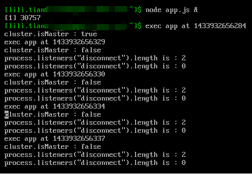
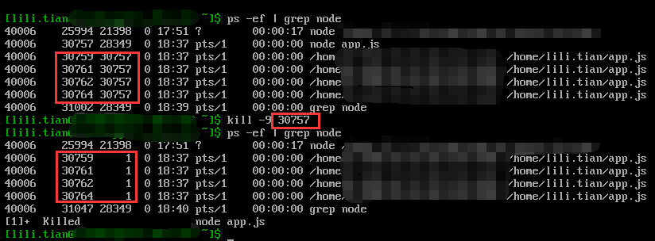
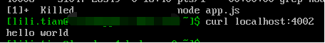
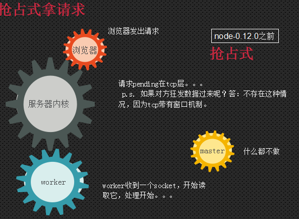
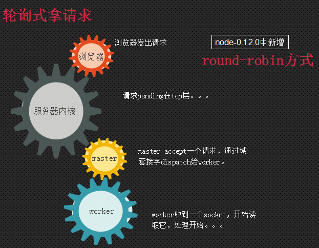
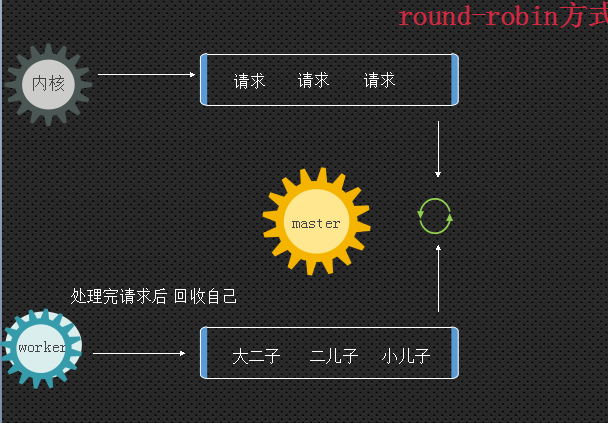

# NODE JS

## cluster
nodejs是一个单进程单线程的服务器引擎,为了可以利用多核CPU实现并行，Node内置了cluster模块

```javascript
var server  = http.createServer()

server.listen(0) //server.listen()是对底层http.Server-->net.Server类的调用
/*
 server.listen(0):在master和worker通信过程，集群中的worker会打开一个随机端口共用

 server.listen(handle):master和worker通信过程，通过handle函数进行通信，而不用进程联系

 server.listen({fd: 7}):在master和worker通信过程，通过传递文件，master会监听“文件描述为7”，而不是传递“文件描述为7”的引用
*/

server.on('listening', function() {
  // listening中获取port就可知node为应用分配的随机port是什么了
  var port = server.address().port
})
```

### cluster工作原理
每个worker进程通过使用child_process.fork()函数，基于IPC（Inter-Process Communication，进程间通信），实现与master进程间通信。

当worker使用server.listen（...）函数时 ，将参数序列传递给master进程。如果master进程已经匹配workers，会将传递句柄给worker。如果master没有匹配好worker，那么会创建一个worker，并将句柄传递给worker

当多个进程都在 accept() 同样的资源的时候，操作系统的负载均衡非常高效。Node.js没有路由逻辑，worker之间没有共享状态。

因为workers都是独力运行的，根据程序的需要，它们可以被独立删除或者重启，worker并不相互影响。只要还有workers存活，则master将继续接收连接。Node不会自动维护workers的数目。我们可以建立自己的连接池

node-0.12.0之前，node的cluster是抢占式拿请求

官方的说法是：
> The worker processes are spawned using the child_process.fork method, so that they can communicate with the parent via IPC and pass server handles back and forth.

> When you call server.listen(...) in a worker, it serializes the arguments and passes the request to the master process. If the master process already has a listening server matching the worker's requirements, then it passes the handle to the worker. If it does not already have a listening server matching that requirement, then it will create one, and pass the handle to the worker.

This causes potentially surprising behavior in three edge cases:

> server.listen({fd: 7}) - Because the message is passed to the master, file descriptor 7 in the parent will be listened on, and the handle passed to the worker, rather than listening to the worker's idea of what the number 7 file descriptor references.

> server.listen(handle) - Listening on handles explicitly will cause the worker to use the supplied handle, rather than talk to the master process. If the worker already has the handle, then it's presumed that you know what you are doing.

> server.listen(0) - Normally, this will cause servers to listen on a random port. However, in a cluster, each worker will receive the same "random" port each time they do listen(0). In essence, the port is random the first time, but predictable thereafter. If you want to listen on a unique port, generate a port number based on the cluster worker ID.

> When multiple processes are all accepting on the same underlying resource, the operating system load-balances across them very efficiently. There is no routing logic in Node.js, or in your program, and no shared state between the workers. Therefore, it is important to design your program such that it does not rely too heavily on in-memory data objects for things like sessions and login.

> Because workers are all separate processes, they can be killed or re-spawned depending on your program's needs, without affecting other workers. As long as there are some workers still alive, the server will continue to accept connections. Node does not automatically manage the number of workers for you, however. It is your responsibility to manage the worker pool for your application's needs.

具体的步骤是：
1. The master creates the listen socket (wrapped by a handle object)
and sends it to the workers.
2. The workers tell the operating system: "Start watching this socket
for new connections."
3. When a new connection comes in, the operating system notifies one
of the workers.
4. The notified worker accepts (opens) the connection and starts
reading/writing.

抢占式请求的特点：
* 一个请求唤醒一个进程
* 抢占式
* 只有sleep状态的进程才被唤醒

看个[demo](https://github.com/shirlyLoveU/shirlyloveu.github.com/blob/master/shirlyDemo/node/cluster.js)

在控制台下输入
```
# node app.js &
```
结果是：



因为我的测试机是4核CPU所以会fork四个进程，每个进程都会执行app.js

kill掉master，看看worker是否依然存在



可见worker依然在监听端口提供服务，我们请求下服务验证下



**注：** 这里的关键是在app.js中remove掉worker的disconnect事件回调，确保在master disconnect掉之后cluster不会disconnect掉worker,具体可看源码

由上面的test我们得出node的多进程机制的过程如下：



在node-0.12.0中新增round-robin轮询机制，其请求过程如下






Buffer.concat(list, [totalLength])的第二个参数 totalLength 是list中所存储的所有buffer.length的最大小，而不是list的长度


buffer字符串的连接
我们接受post数据时，node是以流的形式发送上来的，会触发ondata事件，所以我们见到很多代码是这样写的：

var http = require('http');
 http.createServer(function (req, res) {
  
  var body = '';
  req.on('data',function(chunk){
    //console.log(Buffer.isBuffer(chunk))
    body +=chunk
  })
  req.on('end',function(){
     console.log(body)
     res.writeHead(200, {'Content-Type': 'text/plain'});
         res.end('Hello World\n');
  })
  
 
}).listen(8124);

console.log('Server running at http://127.0.0.1:8124/');
下面我们比较一下两者的性能区别，测试代码：

var buf = new Buffer('nodejsv0.10.4&nodejsv0.10.4&nodejsv0.10.4&nodejsv0.10.4&');
console.time('string += buf')
var s = '';
for(var i=0;i<10000;i++){
    s += buf;
}
s;
console.timeEnd('string += buf')


console.time('buf concat')
var list = [];
var len=0;
for(var i=0;i<10000;i++){
    list.push(buf);
    len += buf.length;
}
var s2 = Buffer.concat(list, len).toString();
console.timeEnd('buf concat')
输出结果，相差近一倍：

string += buf: 15ms
buf concat: 8ms
在1000次拼接过程中，两者的性能几乎相差一倍，而且当客户上传的是非UTF8的字符串时，直接+=还容易出现错误。


buffer的释放
很遗憾，我们无法手动对buffer实例进行GC，只能依靠V8来进行，我们唯一能做的就是解除对buffer实例的引用。

6、清空buffer
刷掉一块buffer上的数据最快的办法是buffer.fill

Node中流分4种类别： readable可读流, writable可写流, transform转换流, duplex双工流


当客户请求服务器资源，服务器会读取data.txt文件到内存，然后把数据再推倒客户端，如果文件很大，就会占用很多内存。更糟的是，如果高并发，性能会更差

var http = require('http');
var fs = require('fs');

var server = http.createServer(function (req, res) {
    fs.readFile(__dirname + '/data.txt', function (err, data) {
        res.end(data);
    });
});
server.listen(3000);

流可以解决这个问题，把文件流和响应流通过 pipe 连起来，这样内存只要有数据就会被及时的“拿走消费”掉，不会出现大量内存被消耗的情况。在这里，用fs.createReadStream方法代替fs.readFile方法

var http = require('http');
var fs = require('fs');

var server = http.createServer(function (req, res) {
    var stream = fs.createReadStream(__dirname + '/data.txt');
    stream.pipe(res);
});
server.listen(3000);


创建可读流
var Readable = require('stream').Readable;

var rs = new Readable;
rs.push('jsera');
rs.push('.net');
rs.push('\n leo is me \n')
//调用.push方法后，并不能马上把数据传递到process.stdout，因为这时只是推到可读流的缓冲区，直到消费者愿意读它
rs.push(null); //push表示rs完成输出数据

rs.pipe(process.stdout);


如果我们能够避免缓冲区，只生成消费者需要的数据，将是更好的方式，可以通过重写可读流的._read方法做到这一点

var Readable = require('stream').Readable;
var rs = Readable();

var c = 100;
rs._read = function () {
    if (c > 'z'.charCodeAt(0)){
        rs.push("\n");
        rs.push(null);
    }else{
        setTimeout(function(){
            rs.push(String.fromCharCode(c++));
        },100)
    }
};

rs.pipe(process.stdout);


值得注意的一点是， rs.push(null) 表示数据已完毕，这时后面再调用 rs.push(data) ，就会抛出下面的异常： god

Error: stream.push() after EOF

### objectMode & readable事件

如果加入 Readable({ objectMode: true }) 参数创建可读流，那么调用.read(n) 时，将以内部每次调用.push(data)时的data为返回数据，而不会根据 n 个字节数返回数据。 


var Readable = require('stream').Readable;
var rs = Readable({objectMode:true});

var c = 100;
rs._read = function () {
    if (c > 'z'.charCodeAt(0)){
        rs.push("\n");
        rs.push(null);
        return;
    }
    setTimeout(function () {
        rs.push(String.fromCharCode(c++));
    }, 100)

};

rs.on("readable",function(){
    console.log(rs.read(3));
})

结果：
d
...
w
x

var Readable = require('stream').Readable;
var rs = Readable();

var c = 100;
rs._read = function () {
    if (c > 'z'.charCodeAt(0)){
        rs.push("\n");
        rs.push(null);
        return;
    }
    setTimeout(function () {
        rs.push(String.fromCharCode(c++));
    }, 100)

};

rs.on("readable",function(){
    console.log(rs.read(3));
})

结果：
null
null
<Buffer 64 65 66>
null
null
<Buffer 67 68 69>
null
null
<Buffer 6a 6b 6c>
null
null
<Buffer 6d 6e 6f>
null
null
<Buffer 70 71 72>
null
null
<Buffer 73 74 75>
null
null
<Buffer 76 77 78>
null
<Buffer 79 7a 0a>
null

可见：
read(3) 每次返回3个字节的数据，如果不够3个字节，那么会打印出null，直到积攒到3个字节返回3个字节的数据，这时候的 objectMode 为 false


### 创建 writableStream 可写流
仅需要重写 ._write 方法即可


var Writable = require('stream').Writable;
var ws = new Writable();
ws._write = function (chunk, enc, next) {
    console.dir('你输入了： '+chunk.toString());
    next();
};

process.stdin.pipe(ws);

执行程序：
$ node nodetest.js
hello shirly
'你输入了： hello shirly\r\n'
hei hei
'你输入了： hei hei\r\n'

chunk 是提供的数据， enc 是数据编码，调用 next() 表示可以继续写入


### 写入数据到一个writableStream
_write 方法是实现子类必须要实现的方法，而writableStream.write 方法并不是它，这点要弄清， write 是用户调用的方法


## 资料 

[读Nodejs多核处理模块cluster](http://blog.fens.me/nodejs-core-cluster/)

[深入浅出Nodejs读书笔记](http://tw93.github.io/2015-03-01/shen-ru-qian-chu-nodejs-reading-mind-map.html)

http://www.alloyteam.com/2013/12/node-js-series-exception-caught/

https://cnodejs.org/topic/516b64596d38277306407936

http://snoopyxdy.blog.163.com/blog/static/60117440201331683752285/

http://snoopyxdy.blog.163.com/blog/static/6011744020134731114493/

http://snoopyxdy.blog.163.com/blog/static/601174402013480524058/