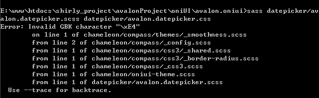

# sass vs less vs stylus

css的三款CSS预处理器（sass,less,stylus）具有一些相同的特性，例如：变量、混入、嵌套、函数、作用域、条件语句、循环语句等

## 背景介绍

**Sass** 是对CSS（层叠样式表）的语法的一种扩充，诞生于2007年，最早也是最成熟的一款CSS预处理器语言，可以更有效有弹性的写出CSS。

其实现在的Sass已经有了两套语法规则：一个依旧是用缩进作为分隔符来区分代码块的；另一套规则和CSS一样采用了大括号（｛｝）作为分隔符。后一种语法规则又名SCSS，在Sass3之后的版本都支持这种语法规则。

**LESS** 是2009年开源的一个项目，是Alexis Sellier受Sass的影响创建的一个开源项目，所以受Sass的影响较大，但又使用CSS的语法，让大部分开发者和设计师更容易上手。LESS提供了多种方式能平滑的将写好的代码转化成标准的CSS代码，Twitter的Bootstrap框架就使用了LESS

**Stylus** 是2010年产生，来自于Node.js社区，主要用来给Node项目进行CSS预处理支持，被称为是一种革命性的新语言，提供一个高效、动态、和使用表达方式来生成CSS，以供浏览器使用。Stylus同时支持缩进和CSS常规样式书写规则。

## 安装

**Sass** 是Ruby语言写的，所以必须先安装Ruby，然后再安装Sass。

**Less** 安装分为两种：客户端和服务器端安装。

#### a. 客户端安装

我们可以直接在客户端使用“.less”（LESS源文件），只需要在官网载一个Javascript脚本文件主“less.js”，然后在我们需要引入LESS源文件的HTML的<head>中加入如下代码：

```html
<link rel="stylesheet/less" type="text/css" href="文件路径/styles.less">
<script src="文件路径/less.js" type="text/javascript"></script> 
```
需要注意的是：在引入“.less”文件中，“link”的“rel”属性要设置为“stylesheet/less”。还有更重要的一点需要注意的是：LESS源文件一定要在“less.js”引入之前引入，这样才能保证LESS源文件正确编译解析。

#### b. 服务器端安装

LESS在服务器端的使用主要是借助于LESS的编译器，将LESS源文件编译生成最终的CSS文件，目前常用的方式是利用node的包管理器（npm）安装LESS，安装成功后就可以在Node环境中对LESS文件进行编译。

**Stylus** 的安装和LESS在服务器端的安装很相似，同样依赖于Node JS的环境

## 命令行下的编译

```css
    sass style.scss style.css   
    sass --watch style.scss:style.css /*单文件的监听*/
    sass --watch sassFileDirectory:cssFileDirectory /*多文件的监听*/

    lessc style.less /*将编译的CSS传递给stdout*/
    lessc style.less > style.css /*将编译的css保存到一个文件中*/

    stylus –compress  <some.styl> some.css
    stylus css /*将css目录下的stylus编译并输出为对应的“.css”文件*/
    stylus css –out public/stylesheets  /*输出到“./public/stylesheets”*/
    stylus one.styl two.styl /*同时编译多个文件*/
```

sass在命令行编译的时候会报下面的错



**解决方案**

```css
  > sass source.scss target.css --default-encoding=utf-8
```

## 语法

三种编译器的语法有其共通和相似性，也有其特别性，下面分别分别对不同编译器语法进行说明

### SASS

sass 文件后缀：.sass 或者 .scss

Sass 中主要有六种数据类型：

* 数字型 (e.g. 1.2, 13, 10px)
* 文本型，单引号、双引号或者不加都可以 (e.g. “foo”, ‘bar’, baz)
* 颜色值类型 (e.g. blue, #04a3f9, rgba(255, 0, 0, 0.5))
* 布尔值 (e.g. true, false)
* nulls (e.g. null)
* 值列表，通过空格或者逗号分割值 (e.g. 1.5em 1em 0 2em,Helvetica, Arial, sans-serif)
* 值映射，一个关键词对应一个值 (e.g. (key1: value1, key2: value2))

sass老的写法完全依靠严格的缩进来书写,新的写法跟css写法一致
```css
/*style.sass老版本语法规则*/
h1
    color:#936
    background-color: #333

/*style.sass新版语法规则*/
h1{
    color:#936;
    background-color:#333;
}
```
sass声明的变量必须以$开头，变量名和变量值之间用冒号:分隔

```css
$mainColor: #963;
$siteWidth: 1024px;
$borderStyle: dotted;

/*调用变量*/                              |  /*转译出来的CSS*/
------------------------------------------+------------------------------
body {                                    |  body {
  color: $mainColor;                      |    color: #963;
  border:1px $borderStyle $mainColor;     |    border:1px dotted #963;
  max-width: $siteWidth;                  |    max-width: 1024px;
}                                         |  }  
```

上述demo的变量是作为属性值来用，例如 color: $color;，那变量能不能用在选择器或者属性上面吗？答案是：yes

```css
$name: foo;
$attr: border;
p.#{$name} {
  #{$attr}-color: blue;
}
```
再看个例子
```css
p {
  $font-size: 12px;
  $line-height: 30px;
  font: $font-size/$line-height;
}
```
编译为：
```css
p {
  font: 0.4;
}
```
显然编译结果不是我们预期的，改为下面这样就ok了：
```css
p {
  $font-size: 12px;
  $line-height: 30px;
  font: #{$font-size}/#{$line-height};
}
```
编译为
```css
p {
  font: 12px/30px;
}
```

sass 中支持+、-、*、/、%运算符
sass中加法连接字符串时，对于引号的合并也有一定规则，如果前面字符串带有引号，后面字符串会自动包含在引号中，如果前面没有，后面带有引号的字符串也会去掉引号：
```css
p:before {
  content: "Foo " + Bar;
  font-family: sans- + "serif";
}
```
编译为：
```css
p:before {
  content: "Foo Bar";
  font-family: sans-serif;
}
```
```CSS
p {
  $width: 10px;
  $width2: 20px;
  width: $width + $width2;
}
```
编译为
```css
p {
  width: 30px;
}
```
```css
p {
  margin: 3px + 4px auto;
}
```
编译为：
```css
p {
  margin: 7px auto;
}
```
```css
$w  : 10;
p:before {
  content: "I ate #{5 + $w} pies!";
}
```
编译为：
```css
p:before {
  content: "I ate 15 pies!";
}
```
对比：
```css
$w  : 10;
p:before {
  content: "I ate 5 + $w pies!";
}
```
编译为：
```css
p:before {
  content: "I ate 5 + $w pies!";
}
```
sass中 ***/*** 运算符使用注意点
```css
p {
  font: 10px/8px;             /* 纯 CSS 不会运算 */
  $width: 1000px;
  width: $width/2;            /* 使用变量，执行运算 */
  width: round(1.5)/2;        /* 使用函数返回值，执行运算 */
  height: (500px/2);          /* 使用括号包裹，执行运算 */
  margin-left: 5px + 8px/2px; /* 用了加法，作为表达式的一部分，执行运算 */
}
```
编译为：
```css
p {
  font: 10px/8px;
  width: 500px;
  width: 1;
  height: 250px;
  margin-left: 9px;
}
```
Sass 运算注意事项

* 建议运算符之间空开一个空格。否则你会发现编译器把下面的 $h- 识别成了一个变量
```css
$w : 7px;
$h : 10px;
p:before {
  width: $h-$w;
}
```
编译为：
```css
Undefined variable: "$h-". on line 4 at column 10
```
对比
```css
$w : 7px;
$h : 10px;
p:before {
  width: $h - $w;
}
```
编译为
```css
p:before {
  width: 3px;
}
```
* 注意运算单位，需要谨记：单位也会参与运算
> 加法：都没有单位输出纯数字；一方有单位，则结果输出该单位；两方相同单位，结果输出该单位；双方单位不同，报错。
> 减法：类似加法。
> 除法：两方相同单位，结果无单位；都没有单位，结果无单位；一方有单位另一方无单位，报错。
> 乘法：两方相同单位，报错；一方有单位，结果输出该单位；两方都无单位，输出无单位。

至于除法和乘法奇葩的运算规则，正如上面说的那样，单位也会参与运算。除法运算的时候，双方都有单位的时候，单位就被消掉了，得到一个数值。乘法的时候，双方都有单位，结果是单位的平方（px x px），自然也不行

sass 的 mixin 需要使用"@mixin"来定义，使用@include来调用，也支持旧版的加好'+'调用；@mixin 定义的内容，不会编译输出。
```css
/*声明一个Mixin叫作“error”*/
@mixin error($borderWidth:2px){
  border:$borderWidth solid #f00;
  color: #f00;
}
/*调用error Mixins*/
.generic-error {
  @include error();/*直接调用error mixins*/
}
.login-error {
  @include error(5px);/*调用error mixins，并将参数$borderWidth的值重定义为5px*/
}   
```

```css
@mixin font($color, $fontSize: 14px) {
    color: $color;
    font-size: $fontSize;
}
p { @include font(blue); }
h1 { @include font(blue, 20px); }
h2 { @include font($fontSize: 18px,$color: red); }
```
编译为
```css
p {
  color: blue;
  font-size: 14px;
}

h1 {
  color: blue;
  font-size: 20px;
}

h2 {
  color: red;
  font-size: 18px;
}
```

由此可见，传递参数时，参数跟声明变量一致，如果变量后跟一个值，则表示该参数是可选的，带有默认值。传参时，需要按照参数定义顺序传參，也可以传參时使用参数名和值这样的参数对来传递，这样就无关参数顺序。

当你定义下面这种 mixin 片段并传值时，报错了：
```css
@mixin box-shadow($shadows) {
  -moz-box-shadow: $shadows;
  -webkit-box-shadow: $shadows;
  box-shadow: $shadows;
}

.shadows {
  @include box-shadow(0px 4px 5px #666, 2px 6px 10px #999);
}
```
由于传递进去的多个值中间被逗号分割，Sass 判定其为两个参数，于是就报错了。解决这个问题，你需要在参数后面加上三个点，表示这个参数可能包含多条属性：

```css
@mixin box-shadow($shadows...) {
  -moz-box-shadow: $shadows;
  -webkit-box-shadow: $shadows;
  box-shadow: $shadows;
}

.shadows {
  @include box-shadow(0px 4px 5px #666, 2px 6px 10px #999);
}
```

多值参数还可以用在 @include 传參的时候，分解某个变量值，例如：

```css
@mixin colors($text, $background, $border) {
  color: $text;
  background-color: $background;
  border-color: $border;
}

$values: #ff0000, #00ff00, #0000ff;
.primary {
  @include colors($values...);
}

$value-map: (text: #00ff00, background: #0000ff, border: #ff0000);
.secondary {
  @include colors($value-map...);
}
```
编译为：
```css
.primary {
  color: #ff0000;
  background-color: #00ff00;
  border-color: #0000ff;
}

.secondary {
  color: #00ff00;
  background-color: #0000ff;
  border-color: #ff0000;
}
```

向 @mixin 传递内容这个功能绝对必不可少，超级实用，特别是在响应式布局中。先看一下官方的例子：

```css
@mixin apply-to-ie6-only {
  * html {
    @content;
  }
}
@include apply-to-ie6-only {
  #logo {
    background-image: url(/logo.gif);
  }
}
```
编译为
```css
* html #logo {
  background-image: url(/logo.gif);
}
```

定义的 apply-to-ie6-only 是一个选择器或者一段代码片段，在其中添加了 @content 这个命令。当使用 @include 命令使用这条 mixin 的时候，将一段内容包裹了起来，这段被包裹的内容就会替换掉 @mixin 中的 @content。
对于 Media Queries 开发就非常方便了，我们可以定义下面这样的代码：
```css
@mixin apply-to-iphone5 {
    @media only screen 
    and (min-device-width : 320px) 
    and (max-device-width : 568px) { 
        @content;
    }
}
@include apply-to-iphone5 {
  #logo {
    background-image: url(/logo@2x.gif);
  }
}
```
编译为
```css
@media only screen and (min-device-width: 320px) and (max-device-width: 568px) {
  #logo {
    background-image: url(/logo@2x.gif);
  }
}
```

Sass样式中的条件语句和其他编程语言的条件语句非常相似，在样式中可以使用“@if”来进行判断：
```css
p {
  @if 1 + 1 == 2 { border: 1px solid;  }
  @if 5 < 3      { border: 2px dotted; }
  @if null       { border: 3px double; }
}

$type: monster;
p {
  @if $type == ocean {
    color: blue;
  } @else if $type == matador {
    color: red;
  } @else if $type == monster {
    color: green;
  } @else {
    color: black;
  }
}
```

sass的for循环语句需要使用@for，并且配置from和through一起使用

#### 基本语法
> @for $var from <start> through <end> {语句块}  

```css
@for $i from 1 through 3 {
  .item-#{$i} { width: 2em * $i; }
}
@each循环语法：
    @each $var in <list> {语句块}
@each $animal in puma, sea-slug, egret, salamander {
  .#{$animal}-icon {
    background-image: url('/images/#{$animal}.png');
  }
}
```

我们还可以增加多个循环变量来构造更加复杂的循环：

```css
@each $animal, $color, $cursor in (puma, black, default),
                                  (sea-slug, blue, pointer),
                                  (egret, white, move) {
  .#{$animal}-icon {
    background-image: url('/images/#{$animal}.png');
    border: 2px solid $color;
    cursor: $cursor;
  }
}
```
编译为

```css
.puma-icon {
  background-image: url("/images/puma.png");
  border: 2px solid black;
  cursor: default;
}

.sea-slug-icon {
  background-image: url("/images/sea-slug.png");
  border: 2px solid blue;
  cursor: pointer;
}

.egret-icon {
  background-image: url("/images/egret.png");
  border: 2px solid white;
  cursor: move;
}
```
也可以循环映射型的参数
```css
@each $header, $size in (h1: 2em, h2: 1.5em, h3: 1.2em) {
  #{$header} {
    font-size: $size;
  }
}
```
编译为

```css
h1 {
  font-size: 2em;
}

h2 {
  font-size: 1.5em;
}

h3 {
  font-size: 1.2em;
}
```

@while循环语句
```css
$i: 6;
@while $i > 0 {
  .item-#{$i} { width: 2em * $i; }
  $i: $i - 2;
}
```
使用 **maps** 比使用多个不同的变量有明显优势。最重要的优势就是 **map** 的遍历功能，这在多个不同变量中是不可能实现的。

另一个支持使用map的原因，是它可以创建 **map-get()** 函数以提供友好API的功能

```css
/* Z-indexes map, gathering all Z layers of the application*/
/* @access private*/
/* @type Map*/
/* @prop {String} key - Layer's name*/
/* @prop {Number} value - Z value mapped to the key*/
$z-indexes: (
  modal: 5000,
  dropdown: 4000,
  default: 1,
  below: -1,
);

/* Get a z-index value from a layer name*/
/* @access public*/
/* @param {String} $layer - Layer's name*/
/* @return {Number}*/
/* @require $z-indexes*/
@function z($layer) {
  @return map-get($z-indexes, $layer);
}
.block {
  z-index: z(modal);
}
```
编译为
```css
.block {
  z-index: 5000;
}
```

扩展（继承）@extend

@extend .icon .icon-button; 这样写。结果报错,所以 @extend 中只能扩展单个选择器，例如：.icon-button、a:hover、a.user:hover等。不过虽然每次 @extend 的是一个整体的选择器，但是你可以将多个选择器写进一条 @extend 命令中，用逗号分割，例如：@extend .message, .important;，表示当前结构复用 .message 和 .important 的代码。

@extend 命令无法用在其他 @ 命令中，例如用在 @media 命令中。当你在上面定义 .clearfix 类时，在 Media Queries 代码里面就无法扩展 .clearfix 类。但是你可以在 Media Queries
里面再定义一个 .clearfix 然后扩展一下。
```css
#admin .tabbar a {
  font-weight: bold;
}
#admin .overview .fakelink {
  @extend a;
}
```
编译为
```css
#admin .tabbar a, 
#admin .tabbar .overview .fakelink, 
#admin .overview .tabbar .fakelink {
  font-weight: bold;
}
```

#### 分析下编译结果

'#admin .overview .fakelink' 选择器要与 '#admin .tabbar a' 共用一段 CSS 代码，而且共用的是 a 标签的代码。由于 #admin 是相同的，所以统一放在最前面，只需要组合后面选择器即可。

既然扩展 a 标签，就先用 .overview .fakelink 替换掉 a 组合成了 #admin .tabbar .overview .fakelink 选择器，由于不知道 .tabbar 与 .overview 类结构的包裹情况，所以又颠倒位置生成了 #admin .overview .tabbar .fakelink 这样一个选择器。这样就足够了，因为已知 .overview .fakelink 是为了替换 .tabbar 选择器的下层结构 a，所以可以确定 .fakelink 结构一定在 .overview 结构的下一级,这样所有情况就遍历完成了。

像之前说的，使用 @extend 需要规划好可复用的类放在上面，然后再在下面 @extend 调用。这样，我们的可复用部分就会编译输出到 CSS 中，但这些代码可能是无意义的，我们并不想使其编译出现在 CSS 文件中，那么就可以使用 % 符号来实现。

带有 % 符号的选择器不会被编译输出，但是可以被 @extend 到，替换之后输出，例如：

```css
#context a %extreme {
  color: blue;
  font-weight: bold;
  font-size: 2em;
}
.notice {
  @extend %extreme;
}
#context .title .notice2 {
  @extend %extreme;
}
```

编译为

```css
#context a .notice, 
#context a .title .notice2, 
#context .title a .notice2 {
  color: blue;
  font-weight: bold;
  font-size: 2em;
}
``` 
再看个例子

```css
%margin-reset { margin: 0; }
%padding-reset { padding: 0; }
%size-reset { width: 100%; height: 100%; }
@mixin add-styles($items) {
    @each $item in $items {
        @extend %#{$item};
    }
}
.footer, .header, .login-box {
    @include add-styles((
        margin-reset,
        padding-reset,
        size-reset
    ));
}
```
编译为

```css
.footer, .header, .login-box {
  margin: 0;
}

.footer, .header, .login-box {
  padding: 0;
}

.footer, .header, .login-box {
  width: 100%;
  height: 100%;
}
```

### less语法

    less和新版sass一样使用css的标准语法，可以说是在现有css语法上添加额外的功能

```css
/*style.less*/
h1 {
  color: #963;
  background-color: #333;
}   
/*less声明变量的方式与sass一致，唯一区别是使用@字符标识*/

@mainColor: #963;
@siteWidth: 1024px;
@borderStyle: dotted;

/*调用变量*/                            |  /*转译出来的CSS*/
----------------------------------------+-------------------------------
body {                                  |  body {
  color: @mainColor;                    |    color:#963;
  border:1px @borderStyle @mainColor;   |    border:1px dotted #963;
  max-width: @siteWidth;                |    max-width:1024px;
}                                       |  }    
```

less中将mixin看成是一个类选择器

```css
/*声明一个Mixin叫作“error”*/
.error(@borderWidth:2px){
  border:@borderWidth solid #f00;
  color: #f00;
}
/*调用error Mixins*/
.generic-error {
  .error();/*直接调用error mixins*/
}
.login-error {
  .error(5px);/*调用error mixins，并将参数@borderWidth的值重定义为5px*/
}   
```

LESS支持的继承和Sass与Stylus不一样，他不是在选择器上继承，而是将Mixins中的样式嵌套到每个选择器里面。这种方法的缺点就是在每个选择器中会有重复的样式产生。

```css
.block {
  margin: 10px 5px;
  padding: 2px;
}
p {
  .block;/*继承.block选择器下所有样式*/
  border: 1px solid #eee;
}
ul,ol {
  .block; /*继承.block选择器下所有样式*/
  color: #333;
  text-transform: uppercase;
}   
```

LESS的条件语句使用有些另类，他不是我们常见的关键词if和else if之类，而其实现方式是利用关键词“when”

```css
.mixin (@a) when (@a >= 10) { 
  background-color: black; 
 } 
 .mixin (@a) when (@a < 10) { 
  background-color: white; 
 } 
 .class1 { .mixin(12) } 
 .class2 { .mixin(6) }  
```

利用When以及&lt;、&gt;、=、&lt;=、&gt;=是十分简单和方便的。LESS并没有停留在这里，而且提供了很多类型检查函数来辅助条件表达式，例如：iscolor、isnumber、isstring、iskeyword、isurl等等。

```css
.mixin (@a) when (iscolor(@a)) { 
  background-color: black; 
 } 
 .mixin (@a) when (isnumber(@a)) { 
  background-color: white; 
 } 
 .class1 { .mixin(red) } 
 .class2 { .mixin(6) }  
```

LESS的条件表达式同样支持AND和OR以及NOT来组合条件表达式，这样可以组织成更为强大的条件表达式。需要特别指出的一点是，OR在LESS中并不是or关键词，而是用,来表示or的逻辑关系

```css
.smaller (@a, @b) when (@a > @b) { 
  background-color: black; 
} 
.math (@a) when (@a > 10) and (@a < 20) { 
  background-color: red; 
} 
.math (@a) when (@a < 10), (@a > 20) { 
  background-color: blue; 
} 
.math (@a) when not (@a = 10)  { 
  background-color: yellow; 
} 
.math (@a) when (@a = 10)  { 
  background-color: green; 
} 

.testSmall {.smaller(30, 10) } 
.testMath1 {.math(15)} 
.testMath2 {.math(7)} 
.testMath3 {.math(10)}
```
编译结果

```css
.testSmall { 
  background-color: black; 
} 
.testMath1 { 
  background-color: red; 
  background-color: yellow; 
} 
.testMath2 { 
  background-color: blue; 
  background-color: yellow; 
} 
.testMath3 { 
  background-color: green; 
}
```

在LESS语言中并没有现在的循环语句，可是像其条件语句一样，通过when来模拟出他的循环功能。

```css
.loopingClass (@index) when (@index > 0) {
  .myclass {
    z-index: @index;
  }
  /* 递归 */
  .loopingClass(@index - 1);
}
/* 停止循环 */
.loopingClass (0) {}

/* 输出 */
.loopingClass (3);
```

### stylus语法
    stylus语法花样多些，既接受标准css语法，也可以使用sass老版本的缩进控制，也接受不带大括号({})和分号的语法,混合的写法绝对是ok的

```css
/*style.styl*/
/*类似于CSS标准语法*/
h1 {
  color: #963;
  background-color:#333;
}
/*省略大括号（｛｝）*/
h1 
  color: #963;
  background-color: #333;
/*省略大括号（｛｝）和分号（;）*/
h1
  color:#963
  background-color:#333
```

stylus声明变量没有任何限制，但变量和变量值之间用等号=分隔

```css
mainColor = #963;
siteWidth = 1024px;
$borderStyle = dotted;

/*调用变量*/                            |    /*转译出来的CSS*/
----------------------------------------+--------------------------------
body                                    | body {
  color mainColor                       |   color: #963;
  border 1px $borderStyle mainColor     |   border:1px dotted #963
  max-width siteWidth                   |   max-width:1024px;
                                        | } 
```

stylus的独特之处在于可以不分配值给变量就可以定义引用属性

```css
/*水平垂直居中*/                    |  /*转译出来的CSS*/
------------------------------------+------------------------------------
#logo                               |   #logo {
  position  absolute                |     position:absolute;
  top  50%                          |     top:50%;
  left  50%                         |     left:50%;
  width  w = 150px                  |     width:150px;
  height  h = 80px                  |     height:80px;
  margin-left  -(w / 2)             |     margin-left:-75px;
  margin-top  -(h / 2)              |     margin-top:-40px;
                                    |   }   
```

stylus可以直接声明mixin名

```css
/*声明一个Mixin叫作“error”*/
error(borderWidth=2px){
  border:borderWidth solid #f00;
  color: #f00;
}
/*调用error Mixins*/
.generic-error {
  error();/*直接调用error mixins*/
}
.login-error {
  error(5px);/*调用error mixins，并将参数$borderWidth的值重定义为5px*/
}   
```

Sass和Stylus的继承是把一个选择器的所有样式继承到另个选择器上。在继承另个选择器的样式时需要使用“@extend”开始，后面紧跟被继承的选择器：

```css
.block {
  margin: 10px 5px;
  padding: 2px;
}
p {
  @extend .block;/*继承.block选择器下所有样式*/
  border: 1px solid #eee;
}
ul,ol {
  @extend .block; /*继承.block选择器下所有样式*/
  color: #333;
  text-transform: uppercase;
}   
```
```css
/* stylus的条件语句，可以省略大括号{}*/
box(x, y, margin = false)
  padding y x
  if margin
    margin y x
body
  box(5px, 10px, true)  

/*与else配套使用*/
box(x, y, margin-only = false)
  if margin-only
    margin y x
  else
    padding y x 
```

Stylus除了这种简单的条件语句应用之外，他还支持后缀条件语句

```css
negative(n)
  error('无效数值') unless n is a 'unit'
  return yes if n < 0
  no    

pad(types = margin padding, n = 5px)
  padding unit(n, px) if padding in types
  margin unit(n, px) if margin in types

body
  pad()

body
  pad(margin)

body
  apply-mixins = true
  pad(padding, 10) if apply-mixins  
```

Stylus样式中通过for/in对表达式进行循环，形式如下：

> for <val-name> [, <key-name>] in <expression>   

```css
body
  for num in 1 2 3
    foo num
```
综上所述，我们对Sass、LESS和Stylus做一个简单的对比总结：

* 三者都是开源项目；
* Sass诞生是最早也是最成熟的CSS预处理器，有Ruby社区和Compass支持；Stylus早期服务器Node JS项目，在该社区得到一定支持者；LESS出现于2009年，支持者远超于Ruby和Node JS社区；
* Sass和LESS语法较为严谨、严密，而Stylus语法相对散漫，其中LESS学习起来更快一些，因为他更像CSS的标准；
* Sass和LESS相互影响较大，其中Sass受LESS影响，已经进化到了全面兼容CSS的SCSS；
* Sass和LESS都有第三方工具提供转译，特别是Sass和Compass是绝配；
* Sass、LESS和Stylus都具有变量、作用域、混合、嵌套、继承、运算符、颜色函数、导入和注释等基本特性，而且以“变量”、“混合”、“嵌套”、“继承”和“颜色函数”称为五大基本特性，各自特性实现功能基本相似，只是使用规则上有所不同；
* Sass和Stylus具有类似于语言处理的能力，比如说条件语句、循环语句等，而LESS需要通过When等关键词模拟这些功能，在这一方面略逊一层；

### 参考资料

[stylus使用遇到问题的时候直接查看其test可以很快的解决大多数问题](https://github.com/stylus/stylus/blob/master/test/run.js)

[CSS预处理器——Sass、LESS和Stylus实践](http://www.w3cplus.com/css/css-preprocessor-sass-vs-less-stylus-2.html)

[sass在线编译sassmeister](http://sassmeister.com/)

[less在线编译器less2css](http://less2css.org/)

[less在线编译器winless](http://winless.org/online-less-compiler)

[编译器转换工具](http://csspre.com/convert/)

[css转stylus](http://css2stylus.com/)

[sass的狂热爱好者](http://hugogiraudel.com/)

[sass高级用法的限制](http://krasimirtsonev.com/blog/article/Two-handy-and-advanced-SASS-features-and-their-limitations)

[Advanced SCSS, or, 16 cool things you may not have known your stylesheets could do](https://gist.github.com/jareware/4738651)

[handy advanced sass](http://12devs.co.uk/articles/handy-advanced-sass/)